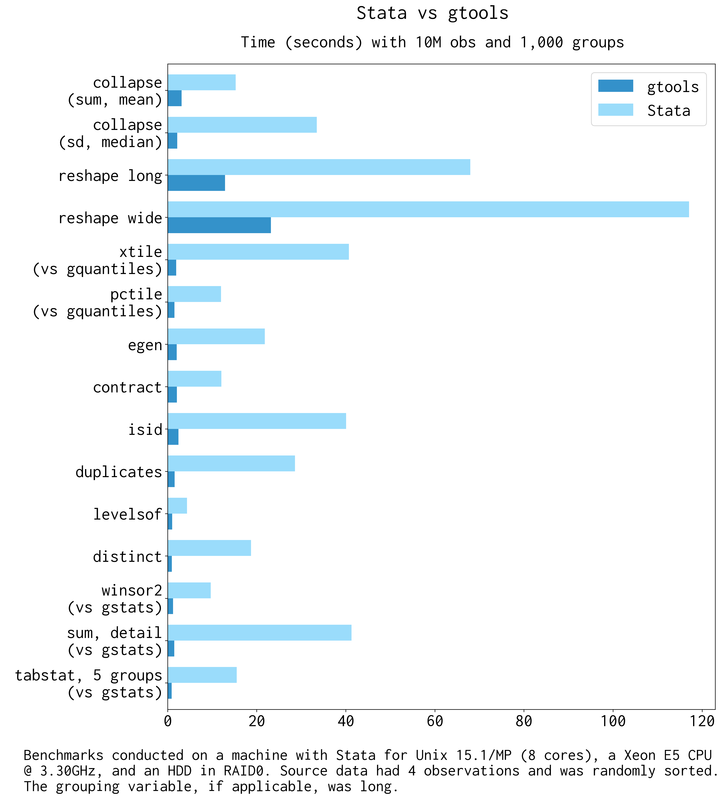

Faster Stata for big data. This packages uses C plugins and hashes
to provide a massive speed improvements to common Stata commands,
including: reshape, collapse, xtile, tabstat, isid, egen, pctile,
winsor, contract, levelsof, duplicates, unique/distinct, and more.


<!--
`version 1.11.7 08Nov2023`
Builds: Linux, OSX [](https://github.com/mcaceresb/stata-gtools/actions/workflows/osx.yml),
Windows (Cygwin) [](https://ci.appveyor.com/project/mcaceresb/stata-gtools)
-->

Overview
--------

This package provides a fast implementation of various Stata commands
using hashes and C plugins. The syntax and purpose is largely analogous
to their Stata counterparts; for example, you can replace `collapse`
with `gcollapse`, `reshape` with `greshape`, and so on. See the
[remarks](#remarks) below for a comprehensive list of differences
(including some extra features!) and each command's usage page for
detailed examples.

__*Quickstart*__

```stata
ssc install gtools
gtools, upgrade
```

Some [quick benchmarks](https://raw.githubusercontent.com/mcaceresb/stata-gtools/master/docs/benchmarks/quick.do):

!!! info "Note"
    Stata 17 introduced massive speed improvements to [sort and collapse](https://www.stata.com/new-in-stata/faster-stata-speed-improvements/).
    In the MP version, in particular with many cores available, the native
    `collapse`  can be up to twice as fast. (YMMV; overall native collapses 
    could still be slower in some use cases.)  `gcollapse` remains faster
    in SE and older Stata versions.



__*Gtools commands with a Stata equivalent*__

| Function     | Replaces    | Speedup (IC / MP)              | Unsupported             | Extras                                  |
| ------------ | ----------- | ------------------------------ | ----------------------- | --------------------------------------- |
| gcollapse    | collapse    | -0.5 to 2 (Stata 17+); 4 to 100 (Stata 16 and earlier)  || Quantiles, merge, labels, nunique, etc. |
| greshape     | reshape     |  4 to 20  / 4 to 15            | "advanced syntax"       | `fast`, spread/gather (tidyr equiv)     |
| gegen        | egen        |  9 to 26  / 4 to 9 (+,.)       | labels                  | Weights, quantiles, nunique, etc.       |
| gcontract    | contract    |  5 to 7   / 2.5 to 4           |                         |                                         |
| gisid        | isid        |  8 to 30  / 4 to 14            | `using`, `sort`         | `if`, `in`                              |
| glevelsof    | levelsof    |  3 to 13  / 2 to 7             |                         | Multiple variables, arbitrary levels    |
| gduplicates  | duplicates  |  8 to 16 / 3 to 10             |                         |                                         |
| gquantiles   | xtile       |  10 to 30 / 13 to 25 (-)       |                         | `by()`, various (see [usage](https://gtools.readthedocs.io/en/latest/usage/gquantiles)) |
|              | pctile      |  13 to 38 / 3 to 5 (-)         |                         | Ibid.                                   |
|              | \_pctile    |  25 to 40 / 3 to 5             |                         | Ibid.                                   |
| gstats tab   | tabstat     |  10 to 50 / 5 to 30 (-)        | See [remarks](#remarks) | various (see [usage](https://gtools.readthedocs.io/en/latest/usage/gstats_summarize)) |
| gstats sum   | sum, detail |  10 to 20 / 5 to 10            | See [remarks](#remarks) | various (see [usage](https://gtools.readthedocs.io/en/latest/usage/gstats_summarize)) |

<small>(+) The upper end of the speed improvements are for quantiles
(e.g. median, iqr, p90) and few groups. Weights have not been
benchmarked.</small>

<small>(.) Only gegen group was benchmarked rigorously.</small>

<small>(-) Benchmarks computed 10 quantiles. When computing a large
number of quantiles (e.g. thousands) `pctile` and `xtile` are prohibitively
slow due to the way they are written; in that case gquantiles is hundreds
or thousands of times faster, but this is an edge case.</small>

__*Extra commands*__

| Function            | Similar (SSC/SJ)         | Speedup (IC / MP)       | Notes                         |
| ------------------- | ------------------------ | ----------------------- | ----------------------------- |
| fasterxtile         | fastxtile                | 20 to 30 / 2.5 to 3.5   | Allows `by()`                 |
|                     | egenmisc (SSC) (-)       | 8 to 25 / 2.5 to 6      |                               |
|                     | astile (SSC) (-)         | 8 to 12 / 3.5 to 6      |                               |
| gstats hdfe         |                          | (.)                     | Allows weights, `by()`        |
| gstats winsor       | winsor2                  | 10 to 40 / 10 to 20     | Allows weights                |
| gunique             | unique                   | 4 to 26 / 4 to 12       |                               |
| gdistinct           | distinct                 | 4 to 26 / 4 to 12       | Also saves results in matrix  |
| gtop (gtoplevelsof) | groups, select()         | (+)                     | See table notes (+)           |
| gstats range        | rangestat                | 10 to 20 / 10 to 20     | Allows weights; no flex stats |
| gstats transform    |                          |                         | Various statistical functions |

<small>(-) `fastxtile` from egenmisc and `astile` were benchmarked against
`gquantiles, xtile` (`fasterxtile`) using `by()`.</small>

<small>(+) While similar to the user command 'groups' with the 'select'
option, gtoplevelsof does not really have an equivalent. It is several
dozen times faster than 'groups, select', but that command was not written
with the goal of gleaning the most common levels of a varlist. Rather, it
has a plethora of features and that one is somewhat incidental. As such, the
benchmark is not equivalent and `gtoplevelsof` does not attempt to implement
the features of 'groups'</small>

<small>(.) Other than the dated 'hdfe' command, I do not know of a stata
command that residualizes variables from a set of fixed effects. The
'hdfe' command, as far as I can tell, morphed into the 'reghdfe'
package; the latter, however, is a fully-functioning regression command,
while 'gstats hdfe' only residualizes a set of variables.</small>

__*Regression models*__

!!! Warning "Warning"
    Regression models are in beta and are only intended as utilities to compute
    coefficients and standard errors. I do not recommend their use in production;
    various post-estimation commands and statistics are _not_ availabe.
    (See `gstats hdfe` for residualizing variables net of fixed effects.)

| Function            | Model   | Similar                        |
| ------------------- | ------- | -----------------------------  |
| gregress            | OLS     | `regress`, `reghdfe`           |
| givregress          | 2SLS    | `ivregress 2sls`, `ivreghdfe`  |
| gglm                | IRLS    | `logit`, `poisson`, `ppmlhdfe` |

All commands allow the user to optionally add:

- `absorb()` for high-dimensional fixed effects absorptions.
- `cluster()` for clustering (multiple covariates assume clusters are nested).
- `by()` for regressions by group.
- `weights` for weighted versions. Unlike other weights, `fweights` are assumed to refer to the _number_ of observations.

Linear regression is computed via OLS (or WLS), IV regression is
computed via two-stage least squares (2SLS), and GLM (poisson or logit)
regression is computed via iteratively reweighted least squares (IRLS). 
See the [TODO](#todo) section for planned features, or the
[Missing Features](usage/gregress#missing-features)
section in the documentation for what is missing before the first
non-beta release.

__*Extra features*__

Several commands offer additional features on top of the massive
speedup. See the [remarks](#remarks) section below for an overview; for
details and examples, see each command's help page:

- [gcollapse](usage/gcollapse#examples)
- [greshape](usage/greshape#examples)
- [gquantiles](usage/gquantiles#examples)
- [gstats sum/tab](usage/gstats_summarize#examples)
- [gstats transform/range/moving](usage/gstats_transform#examples)
- [gtoplevelsof](usage/gtoplevelsof#examples)
- [gegen](usage/gegen#examples)
- [glevelsof](usage/glevelsof#examples)
- [gdistinct](usage/gdistinct#examples)
- [gregress](usage/gregress#examples)
- [givregress](usage/givregress#examples)
- [gglm](usage/gglm#examples) (poisson and logit)

In addition, several commands take gsort-style input, that is

```stata
[+|-]varname [[+|-]varname ...]
```

This does not affect the results in most cases, just the sort order.
Commands that take this type of input include:

- gcollapse
- gcontract
- gegen
- glevelsof
- gtop (gtoplevelsof)

__*Ftools*__

The commands here are also faster than the commands provided by
`ftools`; further, `gtools` commands take a mix of string and numeric
variables, which is a limitation of `ftools`. (Note I could not get
several parts of `ftools` working on the Linux server where I have
access to Stata/MP; hence the IC benchmarks.)

| Gtools    | Ftools        | Speedup (IC) |
| --------- | ------------- | ------------ |
| gcollapse | fcollapse     | 2-9          |
| gegen     | fegen         | 2.5-4 (+)    |
| gisid     | fisid         | 4-14         |
| glevelsof | flevelsof     | 1.5-13       |
| hashsort  | fsort         | 2.5-4        |

<small>(+) Only egen group was benchmarked rigorously.</small>

__*Limitations*__

* `strL` variables only partially supported on Stata 14 and above;
  `gcollapse`, `gcontract`, and `greshape` do not support `strL` variabes.

* Due to a Stata bug, gtools cannot support more
  than `2^31-1` (2.1 billion) observations. See [this
  issue](https://github.com/mcaceresb/stata-gtools/issues/43)

* Due to limitations in the Stata Plugin Interface, gtools
  can only handle as many variables as the largest `matsize`
  in the user's Stata version. For MP this is more than
  10,000 variables but in IC this is only 800. See [this
  issue](https://github.com/mcaceresb/stata-gtools/issues/24).

* Gtools uses compiled C code to achieve it's massive increases in
  speed. This has two side-effects users might notice: First, it is sometimes
  not possible to break the program's execution.  While this is already true
  for at least some parts of most Stata commands, there are fewer opportunities
  to break Gtools commands relative to their Stata counterparts.

  Second, the Stata GUI might appear frozen when running Gtools
  commands.  If the system then runs out of RAM (memory), it could look
  like Stata has crashed (it may show a "(Not Responding)" message on
  Windows or it may darken on \*nix systems). However, the program has
  not crashed; it is merely trying to swap memory.  To check this is the
  case, the user can monitor disk activity or monitor their system's
  pagefile or swap space directly.

Acknowledgements
----------------

* The OSX version of gtools was implemented with invaluable help from @fbelotti
  in [issue 11](https://github.com/mcaceresb/stata-gtools/issues/11).

* Gtools was largely inspired by Sergio Correia's (@sergiocorreia) excellent
  [ftools](https://github.com/sergiocorreia/ftools) package. Further, several
  improvements and bug fixes have come from to @sergiocorreia's helpful comments.

* With the exception of `greshape`, every gtools command has been
  written almost entirely from scratch (and even `greshape` is mostly
  new code). However, gtools commands typically mimic the functionality
  of existing Stata commands, including community-contributed programs,
  meaning many of the ideas and options are based on them (see the
  respective help files for details). `gtools` commands based on
  community-contributed programs include:

    * [`gstats winsor`](https://gtools.readthedocs.io/en/latest/usage/gstats_winsor/index.html#acknowledgements), based on `winsor2` by Lian (Arlion) Yujun

    * [`gunique`](https://gtools.readthedocs.io/en/latest/usage/gunique/index.html#acknowledgements), based on `unique` by Michael Hills and Tony Brady.

    * [`gdistinct`](https://gtools.readthedocs.io/en/latest/usage/gdistinct/index.html#acknowledgements), based on `distinct` by Gary Longton and Nicholas J. Cox.

Installation
------------

I only have access to Stata 13.1, so I impose that to be the minimum.
You can install `gtools` from Stata via SSC:
```stata
ssc install gtools
gtools, upgrade
```

By default this syncs to the master branch, which is stable. To install
the latest version directly, type:
```stata
local github "https://raw.githubusercontent.com"
net install gtools, from(`github'/mcaceresb/stata-gtools/master/build/)
```

### Examples

The syntax is generally analogous to the standard commands (see the corresponding
help files for full syntax and options):
```stata
sysuse auto, clear

* gstats {hdfe|residualize} varlist [if] [in] [weight], [absorb(varlist) options]
gstats hdfe hdfe_price = price, absorb(foreign rep78)
gstats residualize price mpg, absorb(foreign rep78) prefix(res_)

* gstats {sum|tab} varlist [if] [in] [weight], [by(varlist) options]
gstats sum price [pw = gear_ratio / 4]
gstats tab price mpg, by(foreign) matasave

* gquantiles [newvarname =] exp [if] [in] [weight], {_pctile|xtile|pctile} [options]
gquantiles 2 * price, _pctile nq(10)
gquantiles p10 = 2 * price, pctile nq(10)
gquantiles x10 = 2 * price, xtile nq(10) by(rep78)
fasterxtile xx = log(price) [w = weight], cutpoints(p10) by(foreign)

* gstats winsor varlist [if] [in] [weight], [by(varlist) cuts(# #) options]
gstats winsor price gear_ratio mpg, cuts(5 95) s(_w1)
gstats winsor price gear_ratio mpg, cuts(5 95) by(foreign) s(_w2)
drop *_w?

* hashsort varlist, [options]
hashsort -make
hashsort foreign -rep78, benchmark verbose mlast

* gegen target  = stat(source) [if] [in] [weight], by(varlist) [options]
gegen tag   = tag(foreign)
gegen group = tag(-price make)
gegen p2_5  = pctile(price) [w = weight], by(foreign) p(2.5)

* gisid varlist [if] [in], [options]
gisid make, missok
gisid price in 1 / 2

* gduplicates varlist [if] [in], [options gtools(gtools_options)]
gduplicates report foreign
gduplicates report rep78 if foreign, gtools(bench(3))

* glevelsof varlist [if] [in], [options]
glevelsof rep78, local(levels) sep(" | ")
glevelsof foreign mpg if price < 4000, loc(lvl) sep(" | ") colsep(", ")
glevelsof foreign mpg in 10 / 70, gen(uniq_) nolocal

* gtop varlist [if] [in] [weight], [options]
* gtoplevelsof varlist [if] [in] [weight], [options]
gtoplevelsof foreign rep78
gtop foreign rep78 [w = weight], ntop(5) missrow groupmiss pctfmt(%6.4g) colmax(3)

* gregress depvar indepvars [if] [in] [weight], [by(varlist) options]
gregress price mpg rep78, mata(coefs) prefix(b(_b_) se(_se_))
gregress price mpg [fw = rep78], by(foreign) absorb(rep78 headroom) cluster(rep78)

* givregress depvar (endog = instruments) exog [if] [in] [weight], [by(varlist) options]
givregress price (mpg = gear_ratio) rep78, mata(coefs) prefix(b(_b_) se(_se_)) replace
givregress price (mpg = gear_ratio) [fw = rep78], by(foreign) absorb(rep78 headroom) cluster(rep78)

* gglm depvar indepvars [if] [in] [weight], family(...) [by(varlist) options]
gglm price mpg rep78, family(poisson) mata(coefs) prefix(b(_b_) se(_se_)) replace
gglm price mpg [fw = trunk], family(poisson) by(foreign) absorb(rep78 headroom) cluster(rep78)

gglm foreign price rep78 [fw = trunk], family(binomial) absorb(headroom) mata(coefs)
gglm foreign price if rep78 > 2, family(binomial) by(rep78) prefix(b(_b_) se(_se_)) replace

* gcollapse (stat) out = src [(stat) out = src ...] [if] [if] [weight], by(varlist) [options]
gen h1 = headroom
gen h2 = headroom
local lbl labelformat(#stat:pretty# #sourcelabel#)

gcollapse (mean) mean = price (median) p50 = gear_ratio, by(make) merge v `lbl'
disp "`:var label mean', `:var label p50'"
gcollapse (iqr) irq? = h? (nunique) turn (p97.5) mpg, by(foreign rep78) bench(2) wild

* gcontract varlist [if] [if] [fweight], [options]
gcontract foreign [fw = turn], freq(f) percent(p)

* greshape wide varlist,    i(i) j(j) [options]
* greshape long prefixlist, i(i) [j(j) string options]
*
* greshape spread varlist, j(j) [options]
* greshape gather varlist, j(j) value(value) [options]

gen j = _n
greshape wide f p, i(foreign) j(j)
greshape long f p, i(foreign) j(j)

greshape spread f p, j(j)
greshape gather f? p?, j(j) value(fp)

* gstats transform (stat) out = src [(stat) out = src ...] [if] [if] [weight], by(varlist) [options]
* gstats range  (stat) out = src [...] [if] [if] [weight], by(varlist) [options]
* gstats moving (stat) out = src [...] [if] [if] [weight], by(varlist) [options]

sysuse auto, clear
gstats transform (normalize) price (demean) price (range mean -sd sd) price, auto
gstats range  (mean) mean_r = price (sd) sd_r = price, interval(-10 10 mpg)
gstats moving (mean) mean_m = price (sd) sd_m = price, by(foreign) window(-5 5)
```

See the [FAQs](faqs) or the respective documentation for a list of supported
`gcollapse` and `gegen` functions.

Remarks
-------

*__Functions available with `gegen`, `gcollapse`, `gstats tab`__*

`gcollapse` supports every `collapse` function, including their
weighted versions. In addition, weights can be selectively applied via
`rawstat()`, and several additional statistics are allowed, including
`nunique`, `select#`, and so on.

`gegen` technically does not support all of `egen`, but whenever a
function that is not supported is requested, `gegen` hashes the data and
calls `egen` grouping by the hash, which is often faster (`gegen` only
supports weights for internal functions, since `egen` does not normally
allow weights).

Hence both should be able to replicate all of the functionality of their
Stata counterparts. Last, `gstats tab` allows every statistic allowed
by `tabstat` as well as any statistic allowed by `gcollapse`; the
syntax for the statistics specified via `statistics()` is the same
as in `tabstat`.

The following are implemented internally in C:

| Function     | gcollapse | gegen   | gstats tab |
| ------------ | --------- | ------- | ---------- |
| tag          |           |   X     |            |
| group        |           |   X     |            |
| total        |           |   X     |            |
| count        |     X     |   X     |      X     |
| nunique      |     X     |   X     |      X     |
| nmissing     |     X     |   X (+) |      X     |
| sum          |     X     |   X     |      X     |
| nansum       |     X     |   X     |      X     |
| rawsum       |     X     |         |      X     |
| rawnansum    |     X     |         |      X     |
| mean         |     X     |   X     |      X     |
| geomean      |     X     |   X     |      X     |
| median       |     X     |   X     |      X     |
| percentiles  |     X     |   X     |      X     |
| iqr          |     X     |   X     |      X     |
| sd           |     X     |   X     |      X     |
| variance     |     X     |   X (+) |      X     |
| cv           |     X     |   X     |      X     |
| max          |     X     |   X     |      X     |
| min          |     X     |   X     |      X     |
| range        |     X     |   X     |      X     |
| select       |     X     |   X     |      X     |
| rawselect    |     X     |         |      X     |
| percent      |     X     |   X     |      X     |
| first        |     X     |   X (+) |      X     |
| last         |     X     |   X (+) |      X     |
| firstnm      |     X     |   X (+) |      X     |
| lastnm       |     X     |   X (+) |      X     |
| semean       |     X     |   X (+) |      X     |
| sebinomial   |     X     |   X     |      X     |
| sepoisson    |     X     |   X     |      X     |
| skewness     |     X     |   X     |      X     |
| kurtosis     |     X     |   X     |      X     |
| gini         |     X     |   X     |      X     |
| gini dropneg |     X     |   X     |      X     |
| gini keepneg |     X     |   X     |      X     |

<small>(+) indicates the function has the same or a very similar
name to a function in the "egenmore" packge, but the function was
independently implemented and is hence analogous to its gcollapse
counterpart, not necessarily the function in egenmore.</small>

The percentile syntax mimics that of `collapse` and `egen`, with the addition
that quantiles are also supported. That is,

```stata
gcollapse (p#) target = var [target = var ...] , by(varlist)
gegen target = pctile(var), by(varlist) p(#)
```

where # is a "percentile" with arbitrary decimal places (e.g. 2.5 or 97.5).
`gtools` also supports selecting the `#`th smallest or largest value:
```stata
gcollapse (select#) target = var [(select-#) target = var ...] , by(varlist)
gegen target = select(var), by(varlist) n(#)
gegen target = select(var), by(varlist) n(-#)
```

In addition, the following are allowed in `gegen` as wrappers to other
gtools functions (`stat` is any stat available to `gcollapse`, except
`percent`, `nunique`):

| Function     | calls            |
| ------------ | ---------------- |
| xtile        | fasterxtile      |
| standardize  | gstats transform |
| normalize    | gstats transform |
| demean       | gstats transform |
| demedian     | gstats transform |
| moving\_stat | gstats transform |
| range\_stat  | gstats transform |
| cumsum       | gstats transform |
| shift        | gstats transform |
| rank         | gstats transform |
| winsor       | gstats winsor    |
| winsorize    | gstats winsor    |

Last, when `gegen` calls a function that is not implemented internally
by `gtools`, it will hash the by variables and call `egen` with `by`
set to an id based on the hash. That is, if `fcn` is not one of the
functions above,

```stata
gegen outvar = fcn(varlist) [if] [in], by(byvars)
```

would be the same as
```stata
hashsort byvars, group(id) sortgroup
egen outvar = fcn(varlist) [if] [in], by(id)
```

but preserving the original sort order. In case an `egen` option might
conflict with a gtools option, the user can pass `gtools_capture(fcn_options)`
to `gegen`.

__*Differences and Extras*__

Differences from `collapse`

- String variables are not allowed for `first`, `last`, `min`, `max`, etc.
  (see [issue 25](https://github.com/mcaceresb/stata-gtools/issues/25))
- New functions: `nunique`, `nmissing`, `cv`, `variance`, `select#`, `select-#`, `range`, `gini`
- `rawstat` allows selectively applying weights.
- `rawselect` ignores weights for `select` (analogously to `rawsum`).
- Option `wild` allows bulk-rename. E.g. `gcollapse mean_x* = x*, wild`
- `gcollapse (nansum)` and `gcollapse (rawnansum)` outputs a missing
  value for sums if all inputs are missing (instead of 0).
- `gcollapse, merge` merges the collapsed data set back into memory. This is
  much faster than collapsing a dataset, saving, and merging after. However,
  Stata's `merge ..., update` functionality is not implemented, only replace.
  (If the targets exist the function will throw an error without `replace`).
- `gcollapse, labelformat` allows specifying the output label using placeholders.
- `gcollapse, sumcheck` keeps integer types with `sum` if the sum will not overflow.

Differences from `reshape`

- Allows an arbitrary number of variables in `i()` and `j()`
- Several option allow turning off error checks for faster execution,
  including: `fast` (similar to `fast` in `gcollapse`), `unsorted`
  (do not sort the output), `nodupcheck` (allow duplicates in `i`),
  `nomisscheck` (allow missing values and/or leading blanks in `j`), or
  `nochecks` (all of the above).
- Subcommands `gather` and `spread` implement the equivalent commands from
  R's `tidyr` package.
- At the moment, `j(name [values])` is not supported. All values of `j` are used.
- "reshape mode" is not supported. Reshape variables are not saved as
  part of the current dataset's characteristics, meaning the user cannot
  type `reshape wide` and `reshape long` without further arguments to
  reverse the `reshape`. This syntax is very cumbersome and difficult to
  support; `greshape` re-wrote much of the code base and had to dispense
  with this functionality.
- For that same reason, "advanced" syntax is not supported, including
  the subcommands: clear, error, query, i, j, xij, and xi.
- `@` syntax can be modified via `match()`
- `dropmiss` allows dropping missing observations when reshaping from
  wide to long (via `long` or `gather`).

Differences from regression models

`gregress`, `givregress`, and `gglm` do not aim to replicate
the entire table of estimation results, nor the entire suite of
post-estimation results and tests, that `regress` (`reghdfe`),
`ivregress 2sls` (`ivreghdfe`), `poisson` (`ppmlhdfe`), or `logit` make
available. At the moment, they are considered beta software and only
coefficients and standard errors are computed.

- Results are saved either to mata (default) or copied to variables in
  the dataset in memory.
- `by()` and `absorb()` are allowed and can be combined.
- `givregress` does a small sample adjustment (`small`) automatically.
- `givregress` does not exit with error if covariates are collinear with
  the dependent variable.
- If the `givregress` model is not identified, standard errors and
  coefficients are set to missing instead of exiting with error.
- `gglm` runs with option `robust` automatically.
- If the `givregress` model is not identified, standard errors and
- If there are no non-linear covariates (i.e. all observations are
  numerically zero) then the coefficients and standard errors are
  _both_ set to missing.

Differences from `xtile`, `pctile`, and `_pctile`

- Adds support for `by()` (including weights)
- Does not ignore `altdef` with `xtile` (see [this Statalist thread](https://www.statalist.org/forums/forum/general-stata-discussion/general/1417198-typo-in-xtile-ado-with-option-altdef))
- Category frequencies can also be requested via `binfreq[()]`.
- `xtile`, `pctile`, and `_pctile` can be combined via `xtile(newvar)` and
  `pctile(newvar)`
- There is no limit to `nquantiles()` for `xtile`
- Quantiles can be requested via `percentiles()` (or `quantiles()`),
  `cutquantiles()`, or `quantmatrix()` for `xtile` as well as `pctile`.
- Cutoffs can be requested via `cutquantiles()`, `cutoffs()`,
  or `cutmatrix()` for `xtile` as well as `pctile`.
- The user has control over the behavior of `cutpoints()` and `cutquantiles()`.
  They obey `if` `in` with option `cutifin`, they can be group-specific with
  option `cutby`, and they can be de-duplicated via `dedup`.
- Fixes numerical precision issues with `pctile, altdef` (e.g. see [this Statalist thread](https://www.statalist.org/forums/forum/general-stata-discussion/general/1418732-numerical-precision-issues-with-stata-s-pctile-and-altdef-in-ic-and-se), which is a very minor thing so Stata and fellow users maintain it's not an issue, but I think it is because Stata/MP gives what I think is the correct answer whereas IC and SE do not).
- Fixes a possible issue with the weights implementation in `_pctile`; see [this thread](https://www.statalist.org/forums/forum/general-stata-discussion/general/1454409-weights-in-pctile).

Differences from `egen`

- `group` label options are not supported
- weights are supported for internally implemented functions.
- New functions: `nunique`, `nmissing`, `cv`, `variance`, `select#`, `select-#`, `range`
- `gegen` upgrades the type of the target variable if it is not specified by
  the user. This means that if the sources are `double` then the output will
  be double. All sums are double. `group` creates a `long` or a `double`. And
  so on. `egen` will default to the system type, which could cause a loss of
  precision on some functions.
- For internally supported functions, you can specify a varlist as the source,
  not just a single variable. Observations will be pooled by row in that case.
- While `gegen` is much faster for `tag`, `group`, and summary stats, most
  egen function are not implemented internally, meaning for arbitrary `gegen`
  calls this is a wrapper for hashsort and egen.

Differences from `tabstat`

- Multiple groups are allowed.
- Saving the output is done via `mata` instead of `r()`. No matrices
  are saved in `r()` and option `save` is not allowed. However, option
  `matasave` saves the output and `by()` info in `GstatsOutput` (the object
  can be named via `matasave(name)`). See `mata GstatsOutput.desc()` after
  `gstats tab, matasave` for details.
- `GstatsOutput` provides helpers for extracting rows, columns, and levels.
- Options `casewise`, `longstub` are not supported.
- Option `nototal` is on by default; `total` is planned for a future release.
- Option `pooled` pools the source variables into one.

Differences from `summarize, detail`

- The behavior of `summarize` and `summarize, meanonly` can be
  recovered via options `nodetail` and `meanonly`. These two
  options are mainly for use with `by()`
- Option `matasave` saves output and `by()` info in `GstatsOutput`,
  a mata class object (the object can be named via `matasave(name)`).
  See `mata GstatsOutput.desc()` after `gstats sum, matasave` for details.
- Option `noprint` saves the results but omits printing output.
- Option `tab` prints statistics in the style of `tabstat`
- Option `pooled` pools the source variables and computes summary
  stats as if it was a single variable.
- `pweights` are allowed.
- Largest and smallest observations are weighted.
- `rolling:`, `statsby:`, and `by:` are not allowed. To use `by` pass
  the option `by()`
- `display options` are not supported.
- Factor and time series variables are not allowed.

Differences from `levelsof`

- It can take a `varlist` and not just a `varname`; in that case it prints
  all unique combinations of the varlist. The user can specify column and row
  separators.
- It can deduplicate an arbitrary number of levels and store the results in a
  new variable list or replace the old variable list via `gen(prefix)` and
  `gen(replace)`, respectively. If the user runs up against the maximum macro
  variable length, add option `nolocal`.

Differences from `isid`

- No support for `using`. The C plugin API does not allow to load a Stata
  dataset from disk.
- Option `sort` is not available.
- It can also check IDs with `if` and `in` conditions.

Differences from `gsort`

- `hashsort` behaves as if `mfirst` was passed. To recover the default
  behavior of `gsort` pass option `mlast`.

Differences from `duplicates`

- `gduplicates` does not sort `examples` or `list` by default. This massively
  enhances performance but it might be harder to read. Pass option `sort`
  (`sorted`) to mimic `duplicates` behavior and sort the list.

Differences from `rangestat`

- Note that `gstats range` is an alias for `gstats transform` that assumes
  all the stats requested are range statistics. However, it can be called
  in conjunction with any other transform via `(range stat ...)`. It was
  not intended to be a replacement of `rangestat` but it can replicate some
  of its functionality.

- `flex_stat`s (reg, corr, cov) are not allowed (see `gregress`).

- Intervals are of the form `interval(low high [keyvar])`; if `keyvar`
  is missing then it is taken to be the source variable.

- Variables are not allowed in place of `low` or `high`. Instead they
  must be `#[stat]` where `#` is a number and `stat` is an optional
  summary statistic; e.g. `interval(-sd 0.5sd x)`.

- Separate interval and interval variables can be specified for each
  target; e.g. `gstats range (mean -3 3) x (mean -2 . time) y ...`.

- All statistics allowed by `gstats tab` are allowed by `gstats range`
  (except `nunique` or `percent`).

- Options `casewise`, `describe`, and `local` are not allowed.

Hashing and Sorting
-------------------

There are two key insights to the massive speedups of Gtools:

1. Hashing the data and sorting a hash is a lot faster than sorting
  the data to then process it by group. Sorting a hash can be achieved
  in linear O(N) time, whereas the best general-purpose sorts take O(N
  log(N)) time. Sorting the groups would then be achievable in O(J
  log(J)) time (with J groups). Hence the speed improvements are largest
  when N / J is largest.

2. Compiled C code is much faster than Stata commands. While it is true
   that many of Stata's underpinnings are compiled code, several
   operations are written in `ado` files without much thought given
   to optimization. If you're working with tens of thousands of
   observations you might barely notice (and the difference between
   5 seconds and 0.5 seconds might not be particularly important).
   However, with tens of millions or hundreds of millions of rows, the
   difference between half a day and an hour can matter quite a lot.

__*Stata Sorting*__

It should be noted that Stata's sorting mechanism is hard to improve
upon because of the overhead involved in sorting. We have implemented a
hash-based sorting command, `hashsort`, which should be faster Stata's
`sort` for groups, but not necessarily otherwise:

| Function  | Replaces | Speedup (IC / MP)    | Unsupported            | Extras               |
| --------- | -------- | -------------------- | ---------------------- | -------------------- |
| hashsort  | sort     | 2.5 to 4 / .8 to 1.3 |                        | Group (hash) sorting |
|           | gsort    | 2 to 18 / 1 to 6     | `mfirst` (see `mlast`) | Sorts are stable     |

The overhead involves copying the by variables, hashing, sorting the hash,
sorting the groups, copying a sort index back to Stata, and having Stata do
the final swaps. The plugin runs fast, but the copy overhead plus the Stata
swaps often make the function be slower than Stata's native `sort`.

The reason that the other functions are faster is because they don't deal with
all that overhead.  By contrast, Stata's `gsort` is not efficient. To sort
data, you need to make pair-wise comparisons. For real numbers, this is just
`a > b`. However, a generic comparison function can be written as `compare(a, b) > 0`.
This is true if a is greater than b and false otherwise. To invert
the sort order, one need only use `compare(b, a) > 0`, which is what gtools
does internally.

However, Stata creates a variable that is the inverse of the sort variable.
This is equivalent, but the overhead makes it slower than `hashsort`.

TODO
----

Planned features:

- Things to add to gcollapse:
    - `prod`
    - `geomean pos`: exclude negative numbers _and_ zero.
    - `geomean abspos`: ibid but take absolute value first.
    - Generally should you add an `abs` option to everything?
- Flexible save options for `gregress`
    - `predict()`, including `xb` and `e`.
    - `absorb(fe1=group1 fe2=group2 ...)` syntax to save the FE.
    - Choose which coefs/se to save.
- Improve formula documentation for summary statistics (e.g. `gini`)
- Internal consistency test for various parts of `gquantiles`. Each
  function section does cases but they should be consistent!

These are options/features/improvements I would like to add, but I don't
have an ETA for them (i.e. they are a wishlist because I am either not
sure how to implement them or because writing the code will take a long
time). Roughly in order of likelihood:

- `gregress` missing features
    - Non-nested multi-way clustering.
    - HDFE collienar categories check.
    - HDFE drop singletons.
    - Detect separated observations in `gglm, family(poisson)`.
    - Guard against possible overflows in `X' X`
    - Accelerate HDFE corner cases (e.g. very dense multi-way HDFE)
    - Include quick primers on OLS, IV, and IRLS in docs.
- Some support for Stata's extended syntax in `gregress`
- Update benchmarks for all commands. Still on 0.8 benchmarks.
- Dropmissing vs dropmissing but not extended missing values.
- Allow keeping both variable names and labels in `greshape spread/gather`
- Implement `selectoverflow(missing|closest)`
- Add totals row for `J > 1` in gstats
- Improve debugging info.
- Implement `collapse()` option for `greshape`.
- Rolling (interval) and moving options for `gregress`.
- Add support for binary `strL` variables.
- Minimize memory use.
- Add memory(greedy|lean) to give user fine-grained control over internals.
- Create a Stata C hashing API with thin wrappers around core functions.
    - This will be a C library that other users can import.
    - Some functionality will be available from Stata via gtooos, api()
    - Improve code comments when you write the API!
    - Have some type of coding standard for the base (coding style)
- Implement `gmerge`
    - Integration with [ReadStat](https://github.com/WizardMac/ReadStat/tree/master/src)?

About
-----

Hi! I'm [Mauricio Caceres](https://mcaceresb.github.io); I made gtools
after some of my Stata jobs were taking literally days to run because of repeat
calls to `egen`, `collapse`, and similar on data with over 100M rows.  Feedback
and comments are welcome! I hope you find this package as useful as I do.

Along those lines, here are some other Stata projects I like:

* [`ftools`](https://github.com/sergiocorreia/ftools): The main inspiration for
  gtools. Not as fast, but it has a rich feature set; its mata API in
  particular is excellent.

* [`reghdfe`](https://github.com/sergiocorreia/reghdfe): The fastest way to run
  a regression with multiple fixed effects (as far as I know).

* [`ivreghdfe`](https://github.com/sergiocorreia/ivreghdfe): A combination of
  [`ivreg2`](https://ideas.repec.org/c/boc/bocode/s425401.html) and `reghdfe`.

* [`stata_kernel`](https://kylebarron.github.io/stata_kernel): A Stata kernel
  for Jupyter; extremely useful for interacting with Stata.

* [`stata-cowsay`](https://github.com/mdroste/stata-cowsay): Productivity-boosting
  cowsay functionality in Stata.

License
-------

Gtools is [MIT-licensed](https://github.com/mcaceresb/stata-gtools/blob/master/LICENSE).
`./lib/spookyhash` and `./src/plugin/common/quicksort.c` belong to their respective
authors and are BSD-licensed. Also see `gtools, licenses`.
